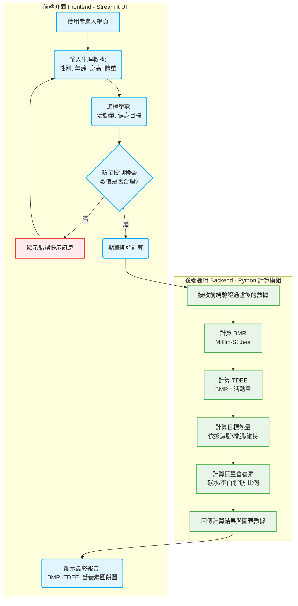

# TDEE 系統架構與流程圖

根據你的計畫書，這個階段我們需要釐清**前端（介面）與後端（計算）的界線**，並定義**防呆機制**。

以下我為你設計了系統運作的邏輯流程圖。你可以直接將這個邏輯參考到 draw.io 或 Figma 中繪製更精美的版本，或者直接將這份文件作為專案開發的參考架構。

## 1. 系統邏輯流程圖 (System Flowchart)

## 2. 前端與後端界線劃分

為了讓你們兩人之後分工（同學 A 與同學 B）更順利，這是前後端的職責劃分：

*   **前端 (Frontend - Streamlit)：負責「互動」與「呈現」**
    *   負責畫出輸入框（Text Input, Number Input）、下拉式選單（Selectbox）與按鈕。
    *   負責接收使用者的輸入，並進行第一線的「防呆」攔截。
    *   負責接收後端算好的數字，並用 Matplotlib 畫成漂亮的圖表展示給使用者看。
*   **後端 (Backend - Python 核心)：負責「大腦」與「計算」**
    *   不碰觸任何網頁介面元素。
    *   寫成一個個獨立的函數（Function），例如 `calculate_bmr(gender, weight, height, age)`。
    *   只負責接收乾淨的數字，套用數學公式，然後吐出結果。

## 3. 防呆機制定義 (Error Handling)

在前端將資料送交給後端計算前，必須通過以下檢查（若未通過，需跳出警告視窗要求重新輸入）：

> [!WARNING]
> 防呆是避免程式崩潰（Crash）的關鍵，以下是你們在開發時需要實作的檢查點：

1.  **必填欄位檢查**：年齡、身高、體重不得為空值。
2.  **數值合理性 (大於零)**：年齡、身高、體重必須 `> 0`。不允許輸入負數或零。
3.  **極端值警告 (可選)**：
    *   身高若 `< 50 cm` 或 `> 250 cm`，可能輸入錯誤。
    *   體重若 `< 20 kg` 或 `> 300 kg`，可能輸入錯誤。
    *   *(這種情況可以給予「確認提示」，而非直接報錯)*
4.  **型別檢查**：確保輸入框進來的都是數值（Integer / Float），而非英文字母或特殊符號。（Streamlit 的 `st.number_input` 預設已具備此防護功能）。
